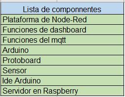
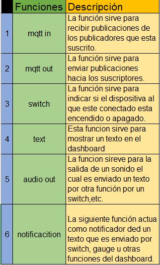
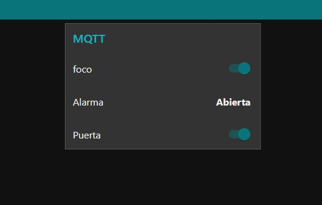
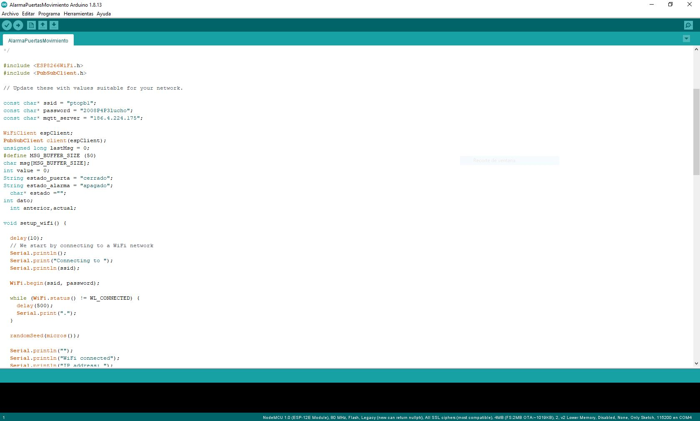
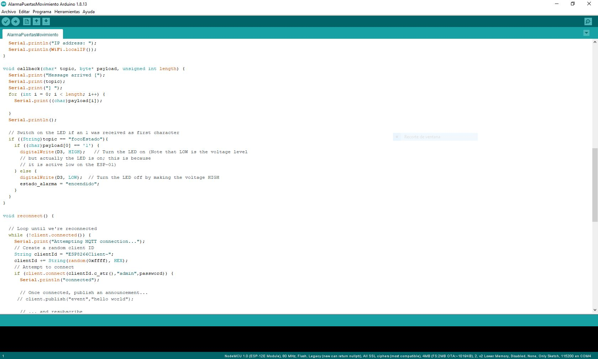
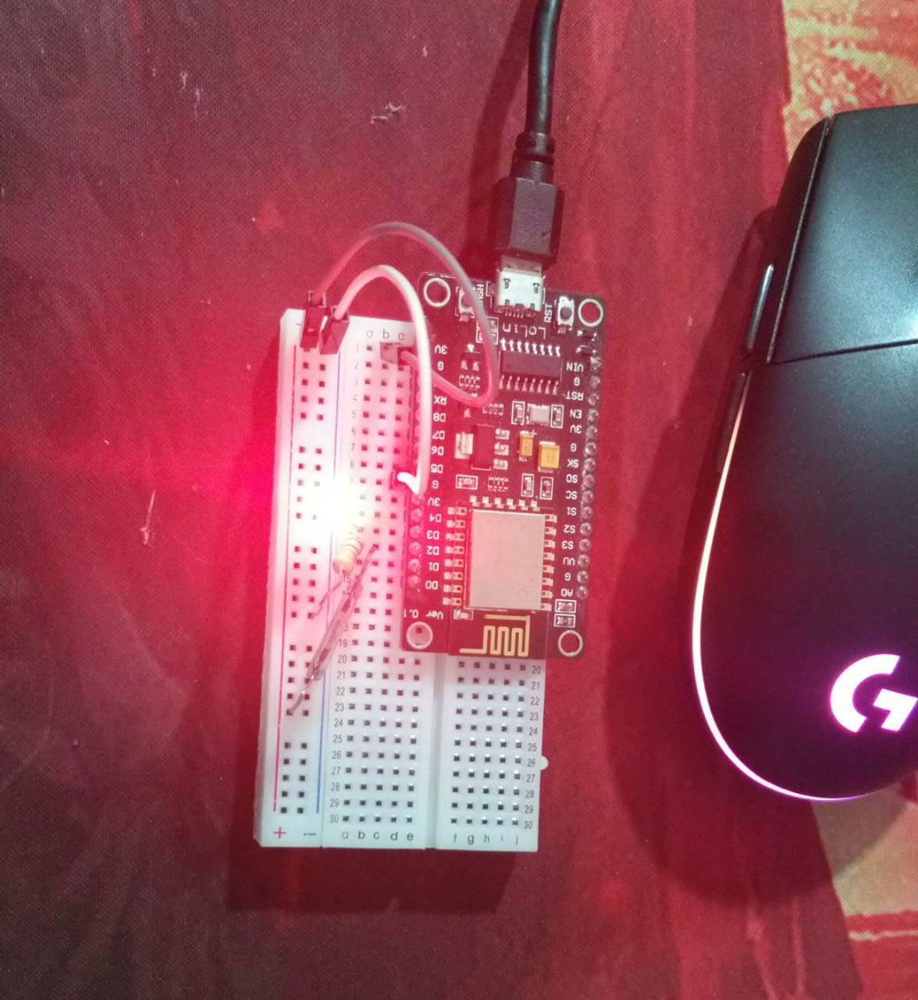
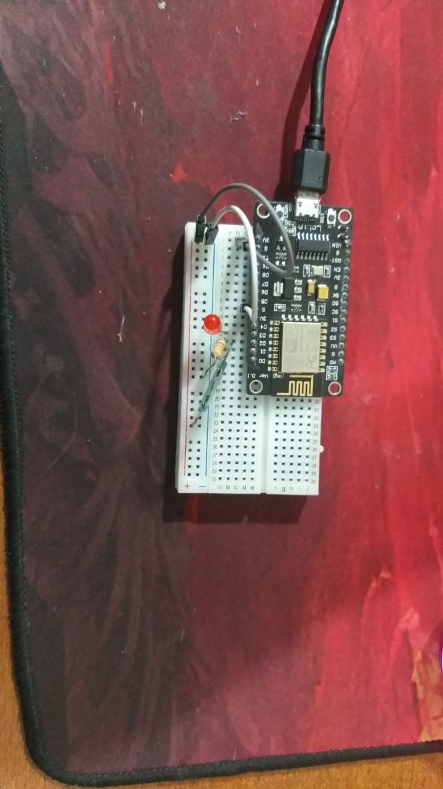
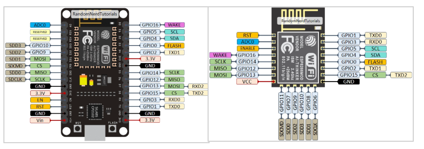

# Informe 
## Envío y recepción de mensajes MQTT con pub/sub en Node -Red  

## 1.PLANTEAMIENTO DEL PROBLEMA

Uno de los servicios de mensajería qué más se emplean actualmente es el MQTT, inclusive se lo utiliza actualmente en el internet de las cosas (Iot) es tanto el empleleo de estre protocolo de mensajeria que para el analisis de sus funciones se desarrollara una aplicación que permita el envío y la recepción de mensajes MQTT con publicación y suscripción mediante el empleamiento de Node-red

## 2.OBJETIVOS

### General:

Desarrollar un programa que permita el envío y recepción de mensajes con MQTT utilizando el servivo de mensajeria pub/sub (publicación y suscripción) mediante la plataforma de node red con la finalidad de comprender el protocolo mqtt, sus funcionamiento, aplicación.
### Específicos:

Analizar el protocolo de mensajería MQTT funcionamiento y aplicaion

Diseñar y desarrollar un programa que permita mostrar la plicaion del protocolo MQTT.

Estructurar la información obtenida como insumo para realizar una exposición ante la clase. 

## 3.ESTADO DEL ARTE

### Tema: Internet of Things using Node-Red and alexa

Investigadores: Anoja Rajalakshmi y Hamid Shahnasser

Año: 2017

Este proyecto trata de determinar en qué medida se puede mejorar el IoT (internet de las cosas) puede conectar dispositivos en diferentes plataformas, con la finalidad de ayudar  a las personas en varios campos como la automatización del hogar, las redes, el monitoreo de datos y otros. Esta nueva interfaz de usuario se puede lograr mediante el servicio de voz de Alexa. El sistema propuesto conecta y controla la mayoría de los dispositivos de IoT conectados mediante Voice. Los dispositivos AWS IoT en la nube envían su entrada de sensor a través de MQTT a Node – Red, debido a que es una herramienta de cableado visual ayuda a conectar dispositivos con facilidad, lo que resulta en configuraciones de conexión rápidas y sin esfuerzo.

Lugar: School of Engineering, San Francisco State University, San Francisco, California

### Tema: Programación de una librería de Python capaz de leer ficheros PDB para representar proteínas en 3D.

Investigadores: Cabrelles Muñoz.

Año:2018

Este proyecto tiene como finalidad el uso de librerías de Python para la visualización de estructuras proteicas tridimensionales mediante el procesado de archivos PDB. Para ello, se utilizaron las herramientas ofrecidas por BioPython para el procesado de datos, y las librerías matplotlib y VisPy para la visualización de los datos procesados. El resultado de este trabajo es un programa cuya interfaz gráfica fue creada mediante la librería Tkinter, que permite la selección del archivo a representar, la selección del motor que se utilizará para la visualización y qué tipo de visualización se generará (CPK, según el tipo de aminoácido al que pertenece, dividido en cadenas, y usando DSSP).

Lugar: Universitat Oberta de Catalunya, España.
 
## 4.MARCO TEÓRICO

### Node-Red

Node-RED es una herramienta de programación visual la cual no muestra visualmente las relaciones y funciones, además, permiten programar sin tener que escribir una línea, todo ello mediante nodos gráficos, lo podemos definir como un editor de flujo basado en el navegador, donde se puede añadir o eliminar nodos y conectarlos entre sí con el fin de hacer que se comuniquen entre ellos, es decir, es una herramienta muy potente que sirve para comunicar hardware y servicios de una forma muy rápida y sencilla simplificando la  programación del lado del servidor gracias a la programación visual.

Por lo tanto, podemos decir que es un modelo que se presta muy bien a una representación visual y lo hace más accesible a una gama más amplia de usuarios. Si alguien puede dividir un problema en pasos discretos, puede ver un flujo y tener una idea de lo que está haciendo; sin tener que entender las líneas individuales de código dentro de cada nodo, para el desarrollo de nuestro ejemplo se utilizara los siguientes nodos:

Mqtt in:
Recibe los datos del estado de la puerta que le envía el publicador. Su configuración es la de colocar la dirección IP, su puerta y en la parte del security colocamos las credenciales del servidor.

Mqtt out:
Hace la propiedad del publicador el publica el estado del foco. Su configuración es la de colocar la dirección IP, su puerta y en la parte del security colocamos las credenciales del servidor.

 
Audio out: 
Muestra los datos del publicador que es la puerta mediante un sonido, por medio del dashboard. Su configuración es de conectar con el swith el cual tiene el nombre de “Puerta”, luego elegimos el Grupo que es “[Proyecto_ivestigacion] MQTT”.

 
Text:
Es solo para colocar un título el cual tiene el nombre de “Alarma” Su configuración es de conectar con el swith el cual tiene el nombre de “Puerta”, luego elegimos el Grupo que es “[Proyecto_ivestigacion] MQTT”.

 
Show notification:
Muestra en el dashboard el estado de la puerta mediante una notificación la cual aparece en la parte superior de la pantalla Su configuración es de conectar con el swith el cual tiene el nombre de “Puerta”, luego elegimos el Grupo que es “[Proyecto_ivestigacion] MQTT” y cambiamos el Label a Alarma.

 
Switch
Sirve para representar dos estados, uno que es el on Payload u off Payload, el cual esta modificado para que envié un texto diciendo “abierta” o “cerrada”, luego elegimos el Grupo que es “[Proyecto_ivestigacion] MQTT”.

### MQTT

MQTT también conocido como Message Queing Telemetry Transport. Es un protocolo de comunicación M2M (machine-to-machine), este tiene como base la pila TCP/IP para la comunicación. Algo característico de este protocolo es que cada conexión se mantiene abierta y se la puede reutilizar en cada comunicación. Su funcionamiento es a través de un servicio de mensajería push con patrón publicador/suscriptor (pub-sub) es decir que  los clientes se conectan con un servidor central llamado bróker, estos mensaje se disponen por medio de tópicos organizados en forma jerárquica para así poder filtrar los mensajes que son enviados a cada cliente, por lo que, un cliente puede publicar un mensaje en un determinado topic y otros clientes interesados pueden suscribirse a dicho topic, mientra que el broker les hará llegar los mensajes suscritos.

Mediante un proceso se lo puede explicar de la siguiente manera, los clientes inician con una conexión TCP/IP con el broker, este mantiene un registro de los clientes que están conectados, la conexión se mantiene abierta hasta que el cliente decida finalizarla MQTT emplea por defecto el puerto 1883 y el 8883 cuando funciona sobre TLS (Transport Layer Security)( seguridad de la capa de transporte), el cliente envía un mensaje CONNECT el cual contiene la información necesaria (nombre de usuario, contraseña, client-id, etc) el broker  una vez captado el envío lo responde con un mensaje CONNACK que contiene el resultado de la conexión (aceptada, rechazada, etc). De´pdendiendo de que tipo de mensajería se desea realiza esta envía distintos mensaje de los cuales podemos obtener:

Para enviar los mensajes el cliente emplea mensajes PUBLISH los cuales contienen el topic y el payload. 

Para suscribirse y desuscribirse se emplean mensajes SUBSCRIBE y UNSUSCRIBE, que el servidor lo responde con SUBACK y UNSUBACK. 

Para asegurar que la conexión siempre está activa los clientes periódicamente mandan un mensaje PINGREQ este es respondido por el servidor con un PINGRESP. 

Para que el cliente se logre desconectar este envia un mensaje de DISCONNECT.

La seguridad en un sistema de comunicación M2M  siempre debe ser un factor primordial a tomar en consideración, el protocolo MQTT dispone de distintas medidas de seguridad esto incluye transporte SSL/TLS y la autentificación por usuario y contraseña o mediante certificado ,pero, hay que tener en cuenta que muchos de los dispositivos de IoT disponen de escasa capacidadal referirnos a la cibersegurirad, por lo que el SLL/TLS puede suponer una carga de proceso importante.

"En muchos casos, la autentificación consiste en una contraseña y usuario que son enviados como texto plano. Por último, también es posible configurar el broker para aceptar conexiones anónimas.Todo esto debe ser tenido en cuenta a la hora de configurar un sistema MQTT, y entender los riesgos de cada uno de ellos, así como su impacto en la eficiencia del sistema"[luisllamas,2019].

MQTT cuenta con múltiples características que le han hecho sobre salir sobre otros competidores. Una de ella es la ventaja del patrón pub/sub como: la escalabilidad, asincronismo, y desacoplamiento que existen  entre los clientes. Por otro lado, La principal su sencillez y ligereza lo hace adecuado para aplicaciones IoT, donde frecuentemente se emplean dispositivos de escasa potencia.

La necesidad de obtener recursos para compensar en un menor consumo de energía, es una ventaja muy  importante en los dispositivos que funcionan 24/7 y muy especialmente en dispositivos alimentados por batería. Gracias a la ligereza del protocolo MQTT es que requiere un ancho de banda mínimo, lo cual es importante en redes inalámbricas, o conexiones con posibles problemas de calidad.Finalmente, MQTT dispone de unas medidas adicionales importantes, comolo son la seguridad y calidad del servicio (QoS). Todo esto conforma a MQTT como una solución largamente testada y consolidad, que aporta robustez y a suvez fiabilidad.

### ESP8266

El ESP8266  es un circuito auxiliar que provee un chip de bajo coste con una pila TCP/IP completa y un microcontrolador funciona con una alimentación  3.3v y dispone de un procesador Tensilica Xtensa LX106 de 80 Mhz, memoria RAM de 64 KB para instrucciones y 96 KB para datos, 16 pines GPIO, pines dedicados UART, e interfaz SPI y I2C, la CPU de Tensilica puede hacerse más veloz mediante overclocking que permiten algunos modelos, aunque no todos. Como complemento, incluye un chip externo de memoria flash QSPI de 512 KB a 4 MB dependiendo del módulo, incluso algunas veces se puede llegar a los 16 MB. En cuanto a las capacidades de conectividad WiFi, es compatible con el estándar IEEE 802.11 b/g/n, además de soportar seguridad WEP, WPA y WPA2.

Para obtener todos los detalles técnicos al completo se utilizo su propio datasheets que poseen los fabricantes desde sus páginas web oficiales. Algunas de las características detalladas  en el datasheet son:

CPU Tensilica Xtensa L106 32-bit RISC 80Mhz
Conversor ADC 10-bit
RAM 64 KB i / 96 KB d
GPIO 16 pines (no se pueden usar todos, además el GPIO16 está conectado al RTC o Real Time Clock)
UART
SPI
I2C
Voltaje 3v y 3.6v
Intensidad 80mA
Temperatura de operación -40 a 125ºC
WiFi IEEE 802.11 b/g/n con soporte IPv4 y protocolos TCP/UDP/HTTP/HTTPS/FTP
Consumo 0.0005 a 170 mA según la potencia de señal
Modos: Active mode (activo), Sleep Mode (dormido), Deep Sleep (sueño profundo) – Afectan al consumo

En el desarrollo del proyecto se utilizó un arduino y en conjunto con él un módulo de internet conocido como el ESP8266 el cual tiene como función agregar capacidad de conectividad WiFi a nuestro proyecto, es decir, permite conexión wireless a una red local o a Internet. Permitiendo un sinfín de posibilidades, como poder conectar o desconectar electrodomésticos (usando un relé) u otro tipo de sistemas mecánicos de nuestro hogar para domotizar la casa y controlarla por Internet desde nuestro Smartphone o cualquier ordenador conectado desde cualquier parte.

Además, puede ser usado en varios campos como: para el control de sistemas de jardinería y riego a través de la red, para automatizar sistemas industriales, control de cámaras IP de videovigilancia, monitorizar datos de redes de sensores distribuídos en distintos puntos, para wereables con capacidad de conexión, para proyectos de IoT (Internet of Things o Internet de las cosas),entre otras.

## 5. LISTA DE COMPONENTES
 
## 6. MAPA DE VARIABLES

 

## 7. APORTACIONES

El código fuente se encuentra en el anexo 1. 

 
## 8. CONCLUSIONES

En conclusion MQTT es un protocolo de comunicación M2M (machine-to-machine)el cual a través de un servicio de mensajería push con patrón publicador/suscriptor (pub-sub) hace que  los clientes se conectan con un servidor central llamado bróker, estos mensaje se disponen por medio de tópicos organizados en forma jerárquic filtrando los mensajes que son enviados a cada cliente, por lo que, un cliente puede publicar un mensaje en un determinado topic y otros clientes interesados pueden suscribirse a dicho topic, mientra que el broker les hará llegar los mensajes suscritos. Este protocolo se ha alzado como uno de los estándares para aplicaciones IoT tanto comerciales como de ámbito maker. Por supuesto, hay muchos más aspectos como: funciones avanzadas de seguridad, permanencia de los mensajes en el broker, configuración de varios brokers.

Otra consecuencia de la ligereza del protocolo MQTT es que requiere un ancho de banda mínimo, lo cual es importante en redes inalámbricas, o conexiones con posibles problemas de calidad.

Por último, MQTT dispone de medidas adicionales importantes, como la seguridad y calidad del servicio (QoS). Por último, es una solución largamente testada y consolidad, que aporta robustez y fiabilidad

 
## 9. RECOMENDACIONES

Algo que se debe tener en cuenta es que para la realización de este proyecto se utilizó un sevidor local en Node-Red, pero si no se tiene un servidor se puede utlizar los servidores que se encuentran en la web, simpre y cuando se tenga en cuenta los parametros y propositos que ofrecen cada uno de estos serrvidores un ejemplo de estos servidores es "DIoTY"un agente MQTT en la nube para Internet de las cosas (IoT),proporcionando una infraestructura estable para construir sus proyectos de IoT; esta basado en MQTT, un protocolo de conectividad M2M / IoT estandarizado por OASIS MQTT TC.  
 
## 10. CRONOGRAMA

 
## 11. BIBLIOGRAFÍA:

[Granado Rodríguez, I. (2018). Integración en la plataforma SmartSantander de un sensor PM2. 5 basado en MQTT.Semle, A., & eFalcom, K. (2016). Protocolos IIoT para considerar. Revista AADECA.

llamas, L. (17 de 04 de 2019). luisllamas. Obtenido de luisllamas: https://www.luisllamas.es/que-es-mqtt-su-importancia-como-protocolo-iot/

A. Rajalakshmi and H. Shahnasser, "Internet of Things using Node-Red and alexa," 2017 17th International Symposium on Communications and Information Technologies (ISCIT), Cairns, QLD, 2017, pp. 1-4, doi: 10.1109/ISCIT.2017.8261194

[De Giusti, A. E., Rodriguez, I. P., Costanzo, M., & Boggia, M. (2017). Cloud robotics: Auto Rover 4WD y cuadricóptero controlados remotamente desde AWS. In XXIII Congreso Argentino de Ciencias de la Computación (La Plata, 2017).

Nuñez-Agurto, D., Benavides-Astudillo, E., Rodríguez, G., & Salazar, D. (2020). Propuesta de una plataforma de bajo costo basada en Internet de las Cosas para Agricultura Inteligente. Cumbres, 6(1), 53-66.

Woo, F. D. J. B., García, A. G., del Real, T. A. R., & Sánchez, E. J. A. (2018). SISTEMA DE ADQUISICIÓN DE DATOS DE BAJO COSTO PARA UN INVERNADERO BASADO EN TECNOLOGÍA DE ACCESO LIBRE. Pistas Educativas, 39(128).

Palaguachi Encalada, S. I. (2018). Diseño, desarrollo e implementación de una estación meteorológica basada en una red jerárquica de sensores, software libre y sistemas embebidos para la Empresa ELECAUSTRO en la Minicentral Gualaceo utilizando comunicación MQTT y MODBUS (Bachelor's thesis).

Villena, M., Serrano, V., Hoyos, D., & Zutara, F. IMPLEMENTACIÓN DE UNA RED DE SENSORES INALÁMBRICA MEDIANTE SISTEMAS EMBEBIDOS Y MQTT PARA EL REGISTRO DE VARIABLES FÍSICAS DE INTERÉS EN ENERGÍAS RENOVABLES.

Campoverde, A. M., Hernández, D. L., & Mazón, B. E. (2015). Cloud computing con herramientas open-source para Internet de las cosas. Maskana, 6, 173-182.

López, R. V. (2020). Propuesta de una estación móvil para la medición de la calidad del aire con el Internet de las Cosas. Revista Multidisciplinaria de Avances de Investigación, 6(1), 1-12.

 
 
## 12. ANEXOS
c

